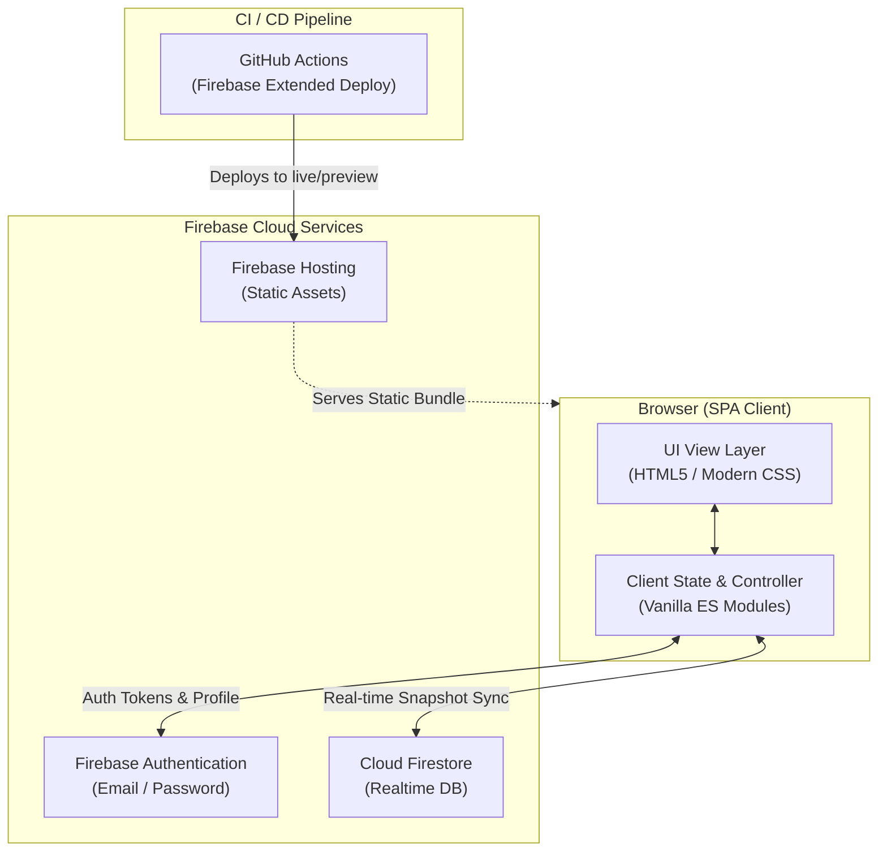

# Spendly

Spendly is a lightweight, real-time shared expense tracker designed for roommates and couples to split costs, monitor monthly spending, and settle balances seamlessly.

The application is built as a client-side Single Page Application (SPA) using vanilla HTML5, modern CSS, and ES module JavaScript, backed by Google Firebase for authentication, real-time database storage, and hosting.

---

## Features

- **User Authentication**: Sign up and sign in with email and password powered by Firebase Authentication, including custom display names.
- **Group Collaboration**: Automatically provisions a shared group on signup; existing members can invite partners or roommates by their registered email address.
- **Real-Time Synchronization**: Live data updates across all active group devices using Cloud Firestore snapshot listeners (`onSnapshot`).
- **Dashboard & Monthly Analytics**:
  - Monthly navigation with localized date and currency formatting (`₹` in `en-IN` format).
  - Summary metrics: Total monthly spending, personal contribution ("You Paid"), partner contribution ("They Paid"), and net balance status.
  - Visual category breakdown sorted by total expenditure.
  - Recent transactions list for the active month.
- **Expense Logging & Splitting**:
  - Log expenses with amount in INR (₹), date, description, and optional notes.
  - 8 pre-defined expense categories with emoji indicators: Food (🍽️), Transport (🚗), Grocery (🛒), Movies (🎬), Shopping (👗), Rent (🏠), Travel (✈️), and Other (💳).
  - Payer attribution across group members.
  - Split calculation options: Equal 50/50 split or Full (non-split personal expense).
- **Settle Up & History**:
  - Automated pairwise balance calculations for equal-split expenses.
  - Instant status indicator ("You owe", "Owed to you", or "All settled").
  - Settlement action logging with timestamps and member notes.
  - Historical settlement log displaying past transactions.
- **Expense Filtering & Management**:
  - Filter all logged expenses by category chip.
  - Inline deletion of expense entries with real-time recalculation.
- **Modern Responsive Dark Theme**:
  - Custom dark color palette using CSS variables (`:root`).
  - Mobile-optimized layouts with custom modals and toast notifications.
  - Typography using Google Fonts (`DM Serif Display` and `DM Sans`).
- **Continuous Deployment**:
  - Automated GitHub Actions workflows for preview channels on pull requests and live deployments to Firebase Hosting on merge to `main`.

---

## Overview & Architecture



### Data Flow
1. **Authentication**: Users authenticate via Firebase Authentication. On login, the user's document in Firestore (`users/{uid}`) is fetched or created.
2. **Group Setup**: If the user has a `groupId`, the group document (`groups/{groupId}`) and all member details are loaded. If not, a new group is created.
3. **Real-time Sync**: The client attaches real-time snapshot listeners to:
   - `groups/{groupId}/expenses` (ordered by date descending)
   - `groups/{groupId}/settlements` (ordered by settled date descending, limit 20)
4. **Calculations**: Whenever an expense is added, deleted, or updated, listener callbacks automatically recalculate monthly totals, category aggregations, and net settlement balances without requiring a page reload.

---

## Software & Technologies

- **Frontend**:
  - HTML5 & Modern CSS (CSS Custom Properties, Flexbox, CSS Grid)
  - Vanilla JavaScript (ES6+ ES Modules)
  - Google Fonts (`DM Serif Display`, `DM Sans`)
- **Backend & Cloud Infrastructure**:
  - Google Firebase JavaScript SDK v10.12.2 (loaded via CDN)
  - Firebase Authentication
  - Cloud Firestore
  - Firebase Hosting
- **CI / CD**:
  - GitHub Actions (`actions/checkout@v4`, `FirebaseExtended/action-hosting-deploy@v0`)
  - Firebase CLI (`firebase-tools`)

---

## Firestore Database Schema

The application uses the following Cloud Firestore document structure:

### Collections & Documents

#### `users/{uid}`
Stores user account profiles and group mapping.
| Field | Type | Description |
| :--- | :--- | :--- |
| `displayName` | `string` | User's display name |
| `email` | `string` | User's email address |
| `groupId` | `string` | ID of the active shared group |
| `createdAt` | `timestamp` | Account creation timestamp |

#### `groups/{groupId}`
Shared group entity containing member references.
| Field | Type | Description |
| :--- | :--- | :--- |
| `createdBy` | `string` | UID of the user who initiated the group |
| `createdAt` | `timestamp` | Group creation timestamp |
| `members` | `string[]` | Array of member UIDs |
| `memberEmails`| `string[]` | Array of member email addresses |

#### `groups/{groupId}/expenses/{expenseId}`
Individual expense records within a group.
| Field | Type | Description |
| :--- | :--- | :--- |
| `description` | `string` | Brief description of the expense |
| `amount` | `number` | Expense amount in INR (₹) |
| `date` | `string` | Date formatted as `YYYY-MM-DD` |
| `category` | `string` | Category identifier (`food`, `transport`, etc.) |
| `paidBy` | `string` | UID of the user who paid |
| `split` | `string` | Split strategy (`equal` for 50/50, `full` for individual) |
| `notes` | `string` | Optional supplementary details |
| `addedBy` | `string` | UID of the creator |
| `createdAt` | `timestamp` | Server timestamp when recorded |

#### `groups/{groupId}/settlements/{settlementId}`
Log entries for settlements made between group members.
| Field | Type | Description |
| :--- | :--- | :--- |
| `amount` | `number` | Settled amount in INR (₹) |
| `note` | `string` | Description of who paid whom |
| `settledBy` | `string` | UID of the user who recorded the settlement |
| `settledAt` | `timestamp` | Server timestamp when settled |

---

## Project Structure

```text
Spendly/
├── .firebaserc                     # Firebase project alias configuration
├── .github/
│   └── workflows/
│       ├── firebase-hosting-merge.yml        # Continuous deployment on merge to main
│       └── firebase-hosting-pull-request.yml  # Preview deployment on pull request
├── .gitignore                      # Git ignore patterns
├── firebase.json                   # Firebase Hosting configuration
├── index.html                      # Root SPA entry file
├── public/                         # Public directory deployed by Firebase Hosting
│   ├── 404.html                    # Firebase Hosting 404 page
│   └── index.html                  # Deployed production entry point
└── README.md                       # Project documentation
```

---

## Installation & Local Development

### Prerequisites
- A modern web browser supporting ES modules.
- (Optional) [Node.js](https://nodejs.org/) and the [Firebase CLI](https://firebase.google.com/docs/cli) for hosting deployment and local emulation.

### Clone the Repository
```bash
git clone https://github.com/koko69420/Spendly.git
cd Spendly
```

### Running Locally
Because Spendly is a static web application without build steps or npm compilation pipelines, it can be served using any static HTTP file server:

#### Option 1: Python HTTP Server
```bash
# Serve the public directory
python3 -m http.server 8080 --directory public
```
Visit `http://localhost:8080` in your web browser.

#### Option 2: Firebase CLI
```bash
# Install Firebase tools globally (if not already installed)
npm install -g firebase-tools

# Login to Firebase
firebase login

# Start local hosting emulator
firebase emulators:start --only hosting
```

---

## Configuration

### Firebase Project Settings
The client initializes Firebase using the `firebaseConfig` object located in `public/index.html` (and `index.html`):

```javascript
const firebaseConfig = {
  apiKey: "YOUR_API_KEY",
  authDomain: "YOUR_PROJECT_ID.firebaseapp.com",
  projectId: "YOUR_PROJECT_ID",
  storageBucket: "YOUR_PROJECT_ID.firebasestorage.app",
  messagingSenderId: "YOUR_MESSAGING_SENDER_ID",
  appId: "YOUR_APP_ID",
  measurementId: "YOUR_MEASUREMENT_ID"
};
```

To configure your own Firebase project:
1. Create a project in the [Firebase Console](https://console.firebase.google.com/).
2. Enable **Email/Password** authentication under **Authentication > Sign-in method**.
3. Create a **Cloud Firestore** database.
4. Add a Web App to your Firebase project and copy the configuration snippet into `public/index.html`.

### Firebase Hosting
Hosting parameters are defined in `firebase.json`:
```json
{
  "hosting": {
    "public": "public",
    "ignore": [
      "firebase.json",
      "**/.*",
      "**/node_modules/**"
    ]
  }
}
```

The active Firebase project alias is stored in `.firebaserc`:
```json
{
  "projects": {
    "default": "spendly-8e6f3"
  }
}
```

### CI / CD Secrets
The GitHub Actions workflow files require the following repository secret in GitHub:
- `FIREBASE_SERVICE_ACCOUNT_SPENDLY_8E6F3`: Service account JSON key generated from Firebase Console for GitHub Actions deployments.

---

## Usage Guide

1. **Create an Account**: Open the app and switch to the **Sign Up** tab. Provide your display name, email address, and a password (minimum 6 characters).
2. **Form a Group**:
   - The first user automatically creates a new group upon signing up.
   - To link a second person, ensure they have signed up for an account. Navigate to **Settings > Group Members**, input their email in the **Invite Member** field, and click **Add**.
3. **Log Expenses**:
   - Click the **+ Add Expense** button.
   - Enter the description, amount (₹), date, category, who paid, and whether to split 50/50 (`equal`) or keep it as a full personal expense (`full`).
   - Click **Add Expense** to broadcast the entry in real-time.
4. **View Metrics & Filter**:
   - Monitor month-to-date totals, individual contributions, and net balance on the **Dashboard**.
   - Browse or filter entries by category on the **All Expenses** tab.
5. **Settle Balances**:
   - Navigate to **Settle Up** to check the current calculated balance between the two group members.
   - Once payments are made offline (via UPI, cash, etc.), click **Mark as Settled** to log the settlement.

---

## Troubleshooting

- **"User not found. They must sign up first."**:
  When inviting a member via email, the invited user must already have completed sign-up on the application so their user profile exists in Firestore.
- **"No expenses found" / Empty Dashboard**:
  Ensure the month selector on the dashboard matches the month and year of the logged expenses.
- **Firebase Permission / Auth Errors**:
  Confirm that Cloud Firestore Security Rules permit read/write operations for authenticated users on the `users` and `groups` collections.

---

## License

No license is explicitly defined in this repository. All rights reserved by the repository owner.
